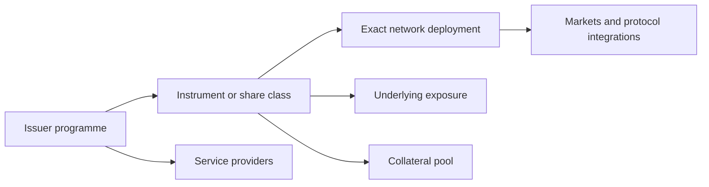

<!-- Plan for unifying the original cross-chain RWA catalogue with the research, evidence and monitoring developed for Solana stocks. -->
# RWA Sonar unification plan

Date: 2026-10-01

Branch: `unification`

Starting point: `universe` at `d922d0f`, containing the latest locally reviewed Solana implementation. The original catalogue remains available on `main` at `8f58030` for comparison.

## Objective and timing

After hackathon judging ends, restore RWA Sonar's public scope to all RWA asset classes and chains. Retain Solana stocks as a prominent, deeply researched part of that coverage. Use the newer research and monitoring system as the foundation of the unified site.

Preserve the existing judging experience until judging is over. The user subsequently authorized implementation and completion of all phases on the unification worktree. This document now records the design and completed local implementation. Production publication and scheduler activation remain separate deployment actions.

The assessment behind this plan reviewed the original catalogue, the newer model and implementation, the live site and primary sources for representative products. It was a framework and data-quality assessment, not renewed legal diligence on every original token. Counts and findings below describe those reviewed snapshots and must be rechecked during migration.

## 1. Do Solana stocks fit the original framework?

Yes. The original framework asks whether a token actually carries the rights and operational properties its marketing implies. That question applies to gold, fund interests, shares, structured notes and other RWAs.

The original 26-record catalogue already included xStocks, Ondo Global Markets, Opening Bell, Remora and Ventuals. The hackathon principally added depth, exact-token coverage and monitoring.

### Original coverage

The original collection included:

- Cash: Circle USDC.
- Products labelled as money-market funds: Superstate USTB, Circle USYC, Janus Henderson JTRSY, OpenEden TBILL, Spiko USTBL, WisdomTree WTGXX, Felix USDhl, Theo thBILL, BlackRock BUIDL, Franklin Templeton FOBXX, Ondo OUSG and VanEck VBILL.
- Gold: TER Gold, Paxos Gold, Tether Gold and Oro GOLD.
- Other commodities: Uranium Digital.
- Private-market products: Apollo ACRED and Hamilton Lane SCOPE.
- Stock-related products: Opening Bell, xStocks, Ondo Global Markets, Remora and Ventuals.
- Yield-bearing notes: Ondo USDY.

These are catalogue labels, not freshly validated classifications. The records assigned 12 entries to Solana, 11 to Ethereum and three to Hyperliquid. They were not comprehensive inventories of each product's deployments.

### The original ladder needs revision

The four-step ladder is:

1. Blockchain is the authoritative ownership ledger.
2. Transfers are unrestricted.
3. Redemption is bearer-based.
4. Forced transfers are possible.

Each step requires every preceding step. These properties are useful, but their sequence does not establish overall maturity, legal strength or usefulness. Using the original stored flags, 21 of 26 records fall into Level 0.

The newer stock classifications expose the problem:

| Product | Newer research identifies | Existing ladder |
| --- | --- | --- |
| Opening Bell | Registered company shares | Level 0 |
| xStocks | Tracker certificates with collateral protections | Level 2 |
| Ondo stocks | Structured notes with collateral security | Level 2 |
| PreStocks | Synthetic exposure with very limited stated holder rights | Level 2 |
| Tessera | Unsecured contractual participation in eventual proceeds | Level 3 |

These describe the model's output at review time, not a recommended quality ranking.

Two questions must become explicit:

- **Authoritative ledger of what?** A blockchain may establish ownership of a tracker certificate while the underlying shares remain recorded elsewhere. The instrument and its collateral are different objects.
- **Which rights survive outside the token?** A transfer-agent master register and an off-chain conversion route can preserve actual shareholder rights even where the chain is not the sole authoritative record.

## 2. Unified analytical framework

Retain the original properties as searchable, sourced facts. Replace the headline maturity ladder with a common set of questions. Do not create a universal quality score by adding these dimensions together.

| Dimension | Required questions |
| --- | --- |
| Rights | What instrument or property interest does the holder own? Against whom? With what priority and recourse? |
| Ownership record | Which record establishes ownership of that instrument? What happens when records disagree? |
| Backing and dependencies | Who owns, holds and verifies the backing? Can it be lent, pledged or substituted? |
| Controls and recovery | Who can freeze, move, burn, mint or alter balances? Under what technical governance and legal procedure? |
| Access and exit | Who may acquire, hold, transfer and redeem? For what consideration, at what cost, and through which functioning route? |
| Failure outcomes | What survives failure of the issuer, tokenization provider, custodian, bridge or holder's keys? |
| Evidence | What supports each answer, what does it prove, and when was it last checked? |

### Separate exposure from legal form

Economic exposure and legal instrument need separate classifications:

- Exposure examples: gold, US equities, private credit, government debt.
- Instrument examples: beneficial ownership, fund interest, secured note, unsecured note, derivative.

The stock-specific claim-depth ladder cannot be applied unchanged to every asset class. Show the legal form directly and assess rights, seniority and recourse within the relevant structure.

Concrete correction to investigate during migration: the original catalogue calls Hamilton Lane SCOPE private equity. Hamilton Lane describes a private-credit strategy accessed through a distinct feeder vehicle. Identify the feeder separately from the underlying fund.

### Split bearer redemption into distinct facts

Record separately:

- Whether a legal entitlement follows a token transfer to a subsequent holder.
- Whether redemption requires identity checks, onboarding or other eligibility conditions.
- Which entity owes performance and which entity processes the request.
- Whether a third-party custodian or agent can perform without the tokenization operator.
- Whether the route is discretionary, conditional on an event, or available on demand.
- Settlement asset, minimums, fees, timing, suspension powers and expiry windows.
- Whether a route is documented, operationally available or supported by observed successful execution.

Tessera illustrates why this matters: its existing Level 3 coexists with payment contingent on proceeds received by the issuer, no proprietary interest in those proceeds and an expiring redemption window. Calling that level "issuer independent" is misleading.

Use `not applicable` where appropriate. An ordinary company share need not be redeemable on demand to be an effective share.

### Separate technical intervention from legal recovery

Do not award maturity points merely because a seizure or forced-transfer power exists. Record:

- Capability and exact scope.
- Controller and key governance, including thresholds, upgrade paths and delays where established.
- Permitted legal circumstances and required procedure.
- Safeguards, notice and holder remedies.
- Evidence of actual use, distinguished from technical possibility.

A recovery mechanism can protect a holder and expose that holder to abuse. Legal recovery remains an important part of the original thesis, but a technical capability alone does not establish legal integration.

Replace the single `issuerIndependent` flag with separate failure scenarios. A bond can depend on its borrower paying while surviving disappearance of its tokenization provider.

### Replace verification rankings with evidence profiles

The newer ordering of issuer statement, auditor, daily agent, on-chain proof of reserves and transfer-agent register is too universal. Those sources prove different propositions.

Record the named source, subject, scope, method, observation or reporting period, publication date, last check, limitations and availability of the underlying evidence. Distinguish promised, obtained, reviewed, current and contradicted evidence.

Concrete issue found in the current implementation: PreStocks receives "auditor" verification strength even though the dossier describes a promised, unpublished attestation. A frequently updated feed also cannot establish title, absence of liens or enforceability merely by being on-chain.

Keep unknown, not applicable, stale and conflicting answers distinguishable. Missing evidence must not become a negative fact or a reassuring zero.

Retain the distinction between source statements, observed facts and analytical conclusions, together with their provenance. Keep exact quotations and locators accessible without making them the default reading layer.

### Add asset-specific modules

| Asset family | Additional analysis |
| --- | --- |
| Stocks and equity-linked products | Corporate actions, dividends, voting, reference security and conversion routes |
| Funds and cash-management products | Share class, portfolio mandate, valuation, distributions, gates and redemption timetable |
| Gold and other commodities | Allocation, custody, inspection, delivery rights, minimum delivery size and costs |
| Credit | Obligor, security, priority, servicing, defaults and recovery waterfall |

Broader asset families should reuse the core questions while adding their own requirements as coverage expands.

### Generalize identity and inheritance

Distinguish the following objects:

Legal conclusions may be inherited only where the applicable instrument, terms, holder scope and effective period match. Chain controls, bridge dependencies, liquidity and protocol support require deployment-specific evidence. Do not inherit a Solana finding automatically onto an Ethereum version.

Keep instrument, programme, deployment and underlying counts separate. Thousands of token addresses do not represent thousands of independent legal analyses. Wrapped or bridged representations need explicit relationships to their backing so aggregate figures do not double-count it.

Keep the original "how completely has this asset been tokenized?" perspective as an advanced lens. Preserve historical methodology context where useful, while making the default reader experience show rights and trade-offs directly.

## 3. Original-catalogue migration and research quality

The original snapshot contained:

- 17 of 26 records without an address.
- 13 attestation records with `#` links.
- 27 attestation records still marked `valid` despite stored expiry dates before 2026-10-01.

These are problems with our research records, not findings that the products themselves are invalid.

During migration:

1. Identify each record as a programme, instrument, share class or exact deployment before merging it into the newer system.
2. Recheck asset classification and distinguish underlying funds from tokenized feeder interests.
3. Verify canonical addresses and network-specific controls from appropriate sources.
4. Replace placeholder evidence with attributable sources or mark the claim unsupported.
5. Review stored dates and expiry semantics; do not invent document dates or attestations to complete a record.
6. Separate current conclusions from retained historical research and record corrections explicitly.
7. Give migrated records honest coverage labels until their legal and technical review is complete.

## 4. Unified UX

### Positioning and navigation

Use an asset-led, question-led interface. Chain is a filter rather than the organizing premise.

Retain the navigation:

**Explore · Compare · Changes · Learn**

Explore becomes the unified catalogue. Solana stocks remain a prominent saved view within it. Retain the current visual identity; the main change is information organization.

Suggested broad positioning: **Know what sits behind your token.** Explain that the site investigates rights, controls, backing, exit routes and changes across RWAs, with coverage depth stated explicitly.

### Explorer

- Search by asset, company, product, issuer or exact address.
- Browse categories such as cash, Treasuries, stocks, credit and commodities.
- Filter by chain, legal-claim type, access restrictions and research coverage.
- Use compact product rows that show what the holder owns; nest network deployments beneath the relevant product.
- Distinguish older catalogue entries, reviewed dossiers and actively monitored deployments.
- Keep exact-address access available for readers who already know their token.

Discovery should adapt to the asset class:

- Apple leads to competing wrappers and their different rights.
- Gold leads to products with different allocation and delivery rights.
- Treasuries leads to funds and notes with different duration, fees, eligibility and exits.

Products sharing exposure must not be presented as interchangeable. Do not let the large stock-address count overwhelm category discovery for the rest of the catalogue.

The concept reviewed in the discussion used a searchable product list and a selected-product panel. It showed the legal claim immediately, followed by exit information and expandable evidence. Older research appeared with an explicit refresh-pending label. This illustrates the information hierarchy rather than prescribing every final layout detail.

### Product report

Answer five questions near the top:

1. What do I own?
2. What can I do with it, and am I eligible?
3. Who can intervene?
4. How do I get out?
5. What happens if something fails?

Use progressive disclosure:

**Answer → reasoning → evidence → technical details**

Show legal-review dates separately from chain and market observation times. An hourly chain check must not make an old legal conclusion look freshly reviewed.

Keep the current exact-token reports and shareable links useful. Provide access to the programme-level dossier without hiding deployment-specific differences.

### Comparison

Support three distinct comparison tasks:

| Comparison | Main question |
| --- | --- |
| Same underlying, different products | How do rights, backing, controls and exits differ? |
| Same instrument, different chains | What changes in controls, bridges, liquidity and usability? |
| Similar economic exposure | How do structure, access, fees, valuation and redemption differ? |

Default to two products on mobile and emphasize material differences. Preserve missing and not-applicable states. Avoid comparing unlike yields or valuations without explaining their basis.

### Changes and advanced research

Use the shared change journal for material changes to documents, controls, backing, exit routes and protocol support. Keep real-world changes separate from corrections to our own research.

Keep the planets view, trust graph and attestation visualization as optional exploration tools. The normal product report must be understandable without them. Preserve confirmed protocol use as distinct from theoretical composability.

## 5. Implementation sequence

### Phase 1: Broaden the front door after judging

- Update positioning and navigation to reflect all asset classes and chains.
- Preserve the Solana landing route, judging experience and existing report links.
- Make original assets discoverable with coverage and freshness labels.
- Keep stale catalogue facts from appearing to have the same research depth as reviewed stock dossiers.

### Phase 2: Introduce the framework and refresh representative products

- Implement explicit exposure, instrument and deployment identities.
- Introduce the common analytical dimensions and scoped evidence profiles.
- Remove the universal maturity score from the default reader journey while retaining historical methodology context where appropriate.
- Refresh USDC, PAXG, BUIDL, FOBXX, USDY, ACRED and SCOPE first. They exercise materially different structures.
- Apply the shared product-report and comparison patterns to those records and existing stock research.

### Phase 3: Complete migration and expand monitoring

- Migrate and re-review the remaining original records.
- Extend monitoring chain by chain, preserving the existing Solana capabilities.
- Add deployment-specific controls, bridges, exits and protocol integrations only as evidence supports them.
- Publish separate counts for reviewed products, identified deployments and monitored deployments.

## 6. Acceptance criteria

- An ordinary reader can identify the legal claim, principal dependencies and available exit route without learning the scoring vocabulary.
- A registered share, a secured note and synthetic exposure cannot be confused merely because they share a ticker or asset category.
- The same product on different networks shares only conclusions whose evidence scope supports inheritance.
- Missing, not-applicable, stale and contradictory evidence remain visibly different states.
- A fresh chain observation cannot refresh a legal-review date.
- Existing Solana reports, comparisons and monitoring remain reachable through their existing links.
- The original catalogue is searchable without implying that every old record has been re-reviewed or is actively monitored.
- Mobile exploration works at 300–400 px, and the default two-product comparison makes material differences readable.
- Broad coverage totals do not conflate products, programmes, deployments or duplicated backing.

Use focused headless checks for identity, inheritance, evidence-state and comparison logic during implementation. Inspect actual desktop and mobile UI behavior. Do not treat a synthetic usability rehearsal as evidence of real-user comprehension.

## 7. References

- [Original catalogue at the reviewed main snapshot](https://github.com/Poglavar/rwa-sonar/blob/8f58030/rwa-assets-db.json)
- [Original evidence database](https://github.com/Poglavar/rwa-sonar/blob/8f58030/attestations-db.json)
- [Original vocabulary](https://github.com/Poglavar/rwa-sonar/blob/8f58030/vocabulary.md)
- [Current grading implementation at the reviewed snapshot](https://github.com/Poglavar/rwa-sonar/blob/d922d0f/stocks/lib/grade.mjs)
- [Issuer dossiers](https://rwasonar.com/issuers/)
- [Current methodology](https://rwasonar.com/methodology.html)
- [xStocks legal overview](https://docs.xstocks.fi/docs/product-legal-overview)
- [Exodus–Superstate executed transfer-agency agreement](https://www.sec.gov/Archives/edgar/data/1821534/000182153426000009/digitaltransferagencyagree.htm)
- [Tessera terms](https://terms.tessera.pe/)
- [Hamilton Lane SCOPE feeder announcement](https://www.hamiltonlane.com/en-us/news/scope-available-via-securitize)
- [Circle USDC terms](https://www.circle.com/legal/usdc-terms)
- [PAX Gold terms](https://www.paxos.com/terms-and-conditions/pax-gold-terms-conditions)
- [Ondo stock holder protections](https://docs.ondo.finance/ondo-stocks/trust-and-transparency)

Relevant implementation context in this worktree: `stocks/MODEL.md`, `stocks/EVIDENCE.md`, `stocks/lib/grade.mjs`, `stocks/data/issuers/`, `UX-audit1.md` and `COMPREHENSION-REHEARSAL.md`. Their existing decisions and limitations should inform implementation; older descriptions may lag current artifacts.

## 8. Implementation record — completed locally, 2026-10-01

All three implementation phases are complete in this worktree. Production deployment and scheduler activation remain pending.

- The shared explorer covers all 21 non-stock catalogue products and 12 stock programme dossiers. Existing Solana entry points, exact-token cards, comparisons and advanced research pages remain reachable.
- The common report and comparison model separates instrument/product reviews from programme summaries. Stock programme findings are never inherited into an unresolved instrument or mint. Holder contexts, terms snapshots, effective periods, exact deployments and evidence states govern applicability.
- All 21 non-stock entries were re-reviewed against accessible primary sources. A completed public-source review is not a claim that confidential offering documents, independent reserve reports or insolvency opinions were obtained. Unsupported rights remain unknown; USDY terms/vintage and thBILL composition conflicts remain visible. HLSCOPE is classified as credit and its feeder is distinguished from the underlying fund.
- The three comparison tasks are implemented through exact deployment selection: competing wrappers of an underlying security, one instrument across networks, and similar exposure across products. Programme findings are labeled separately; deployment controls and market snapshots are never substituted for legal terms.
- Native Ethereum and Solana observations use finalized blocks/slots, retain failed-read uncertainty and preserve the last successful read. Conventional proxy slots and ABI responses do not establish all upgrade paths or key governance. Solana scheduled multipliers and fees use the observed slot's time/epoch where available.
- Official network listings are retained for additional networks without claiming technical review. Wrapped and portfolio-linked exposure is described explicitly; there is no aggregate reserve total that double-counts backing.
- The existing source watcher includes all curated product sources with product/context/terms attribution. Only observed external control deltas enter the shared public journal; baseline reads and decoder/editorial corrections do not.
- Historical attestation displays now distinguish expired research records, unavailable sources and recorded-but-unverified validity. Original evidence dates, links and stored records were not rewritten.
- Release construction builds the shared report runtime before the catalogue and validates their source joins. Private watcher state is excluded from publication; its scoped observations are embedded in the generated report artifact.

### Refinements to the original plan

Programme-level research is useful without inventing individual instrument identities for thousands of stock addresses. Existing programme evidence is adapted at its original check dates; it is not stamped as a fresh legal review. The count of instrument research subjects is therefore distinct from a count of completely identified legal instruments.

Monitoring starts with Ethereum and Solana read adapters, alongside the preserved stock monitoring system. Other networks remain source-listed until an appropriate adapter and evidence review are added. “Configured watch scope” and “recent successful observation” are separate counts; neither proves that a scheduler is currently running. This implementation prepares the hourly job and its outcome-check specification but does not activate production jobs.

Access restrictions appear in the applicable holder context rather than as a universal eligible/ineligible badge. USDC EEA and non-EEA redemption contexts illustrate why a global restriction flag would be misleading. The explorer filters the legal form, chain and coverage; reports expose the relevant access and exit conditions directly.

### Local operation and verification

See `rwa/README.md` for rebuild, read-only polling, publication boundaries and the inactive central-monitor registration. Fast headless tests cover applicability, source joins, comparison modes, failure preservation, decoder baselines, legacy evidence display and release construction. The shared reports/comparisons, explorer and observation panel were inspected in a dedicated headed browser at desktop, 375 px and 300 px; this is visual verification, not a real-user comprehension study.
